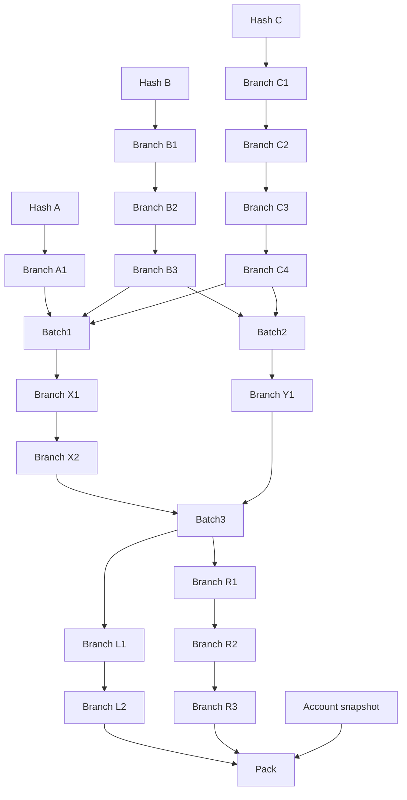

# Complete offline proof chain

Open [proof-chain.json](proof-chain.json) in **History → Proof inspector**.
The [node index](nodes.md) maps the graph to its source files, addresses and timeline.

This is a deterministic demonstration, not a record of real historical transactions. Its hashes, canonical
IDs, PDA addresses and commitments are computed using the project's SDK, but its
timestamps and wallet snapshot are fictional. No RPC, wallet signing or deployment
is involved in generation. Localnet preloads its final Pack as described below;
a valid archive alone is not proof of on-chain existence.

## Files and history

- [A.txt](files/A.txt), [B.txt](files/B.txt), [C.txt](files/C.txt) contain
  `Hello World 1`, `Hello World 2`, `Hello World 3`, respectively.
- Each file is UTF-8 with a final LF newline. Hashes cover those exact bytes.
  Recreating a file without the newline changes its hash.
- Every Branch has a real version file: a copy of its parent's text with a new
  version line. After a Batch, the version file combines its ordered members'
  documents, then adds the new version line.
- A Branch payload is SHA-256 of that version file. Its stored hash additionally
  commits to the parent record's canonical ID, source kind, time and generation;
  it is not the file's SHA-256 alone.
- The separate Account node commits to a complete synthetic wallet snapshot.
  Pack includes that node and the two final Branch tips, retaining ordered
  membership in the archive.

There are 24 records: 3 Hash, 16 Branch, 3 Batch, 1 Account and 1 Pack, backed by
19 text files. Times run from **12:00 to 12:47 UTC on 1 September 2026**, with every
record strictly later than its dependencies. Shared inputs keep the same historical
timestamp everywhere; Branch generation resets to 1 after a Batch.



The archive itself contains only the supported version-1 fields, without filenames,
labels or extra metadata. See the [canonical format](../../hash-timestamp/docs/archive.md).

## Localnet anchor

The localnet service preloads only the final Pack from [ledger/pack.json](ledger/pack.json)
and its supporting [VoteInfo](ledger/pack-vote.json). This is one live proof node,
not the entire history; all 23 predecessors and the synthetic snapshot's target
wallet stay unseeded. The Pack's source, timestamp, hash, PDA, bump, allocated data
and initial vote match the archive and contract. The fixture voter uses a public,
deterministic test seed; it is not a real wallet and must never receive real funds.

These accounts are injected at genesis, not by replaying historical transactions.
The chosen historical timestamps remain demonstration values, even when Pack is
present on localnet. Existing ledgers are preserved and cannot acquire these
fixtures on restart. Follow [new-ledger setup](../../docs/localnet.md#proof-chain-example)
to start a separate local chain.

**Restore limitation:** the complete 24-node proof exceeds the current instruction
encoding/transaction size limit. The live Pack allows inspecting and checking the
retained file history, but does not make full-graph Restore fit. This example
deliberately adds no intermediate live anchors and does not change the protocol
or SDK to bypass that limit.

## Check or reproduce

From the repository root:

```sh
npx vitest run tests/unit/proof-chain-example.test.ts
```

[generate.ts](generate.ts) is a pure deterministic generator used by that test.
It does not write files. To print a JSON map of artifact paths to their contents:

```sh
node examples/proof-chain/emit.mjs
```
